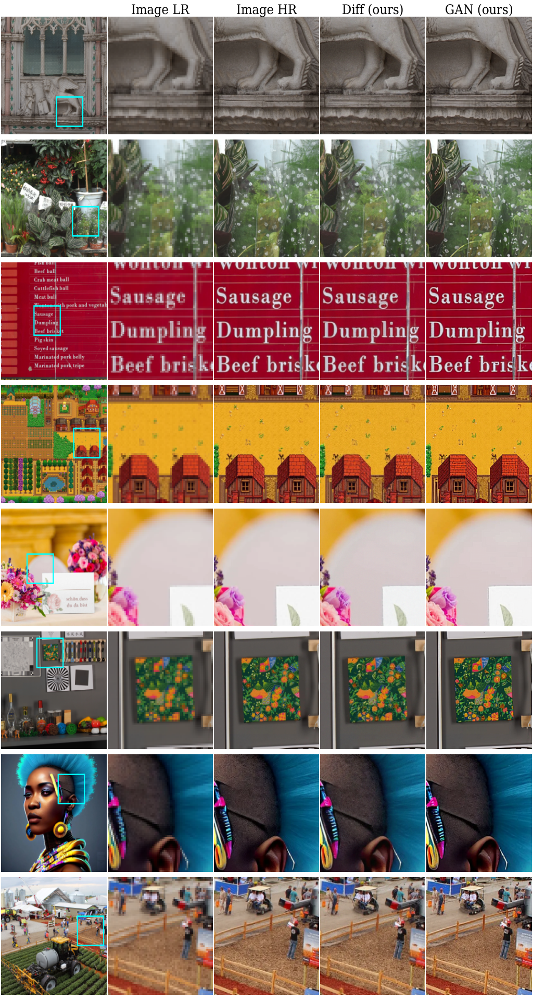

# Does Diffusion Beat GAN in Image Super Resolution?

This is the official inference code for our paper "Does Diffusion Beat GAN in Image Super Resolution?.

In this work we provide comparison between GAN-based and diffusion SR paradigms in controlled experimental setting. 

We plan to add the inference code with usage examples and links to the model checkpoints. 

## Visualizations

GAN vs Diffusion Super Resolution models on SR$(\times 4)$ task.

GAN vs Diffusion Super Resolution models on SR$(\times 4)$ task with degradations from [RealESRGAN](https://arxiv.org/abs/2107.10833) work.

